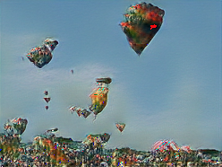
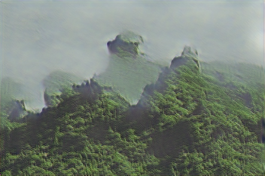
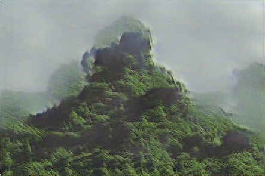

# SinGAN_easy_tensorflow
Native TensorFlow API implementation of SinGAN paper (https://arxiv.org/pdf/1905.01164.pdf). This implementation may be easier to understand for beginners (one single file for training)

# Contents
1. [Results](#results)
2. [Modification from original paper](#modification-from-original-paper)
3. [Installation](#installation)
4. [Usage](#usage)

# Results
| Image | Random Sample 1 | Random Sample 2 | Random Sample 3 |
|------------|-------|-------|-------|
|  |  |  |  |
|  |  |  |  |

| Image | Random Sample 1 | Random Sample 2 | Random Sample 3 |
|------------|-------|-------|-------|
|  |  |  |  |

# Modification from original paper
In the paper, to ensure the original image exists in the solution space of generator, noise map is kept as (z*N, 0, 0, 0, ...) from coarsest scale to finest scale. Here z*N is kept fixed while training. Further random samples are generated from noise map (zN, zN-1, zN-2, ...) etc.

# Installation
Installation steps tested for Windows 10 64-bit and Python 3.5

### 1. Download repository
Open Git Bash terminal, navigate to desired location and clone repository using `git clone https://github.com/shiveshc/SinGAN_easy_tensorflow.git`.

Or click on `Code` button on top right corner and `Download ZIP`.

### 2. Set up venv and instal libraries
Open command line terminal as administrator and navigate to cloned repository path using `cd .\SinGAN_easy_tensorflow`.

Next run following commands - 
| Windows 10 | MacOS |
|------------|-------|
| 1. `python -m venv env` | 1. `python -m venv env` |
| 2. `env\Scripts\activate.bat` | 2. `source env/bin/activate` |
| 3. `python -m pip install --upgrade "pip < 21.0"` | 3. `python -m pip install --upgrade "pip < 21.0"` |
| 4. `pip install -r requirements.txt` | 4. `pip install -r requirements.txt` |

Installation should take 10-15 minutes.

Common installation errors -
1. pip version is not upgraded\
    __solution :__ upgrade pip using `python -m pip install --upgrade pip`
2. pip version is not compatible with python version\
    __solution :__ install suitable pip version e.g. pip version < 21.0 is compatible with Python 3.5.

# Usage
To train on `balloons.png` in `data folder` run - \
1. `env\Scripts\activate.bat`\
2. `python train.py /data/balloons.png output_path -scales 6 -iters 75 1`
